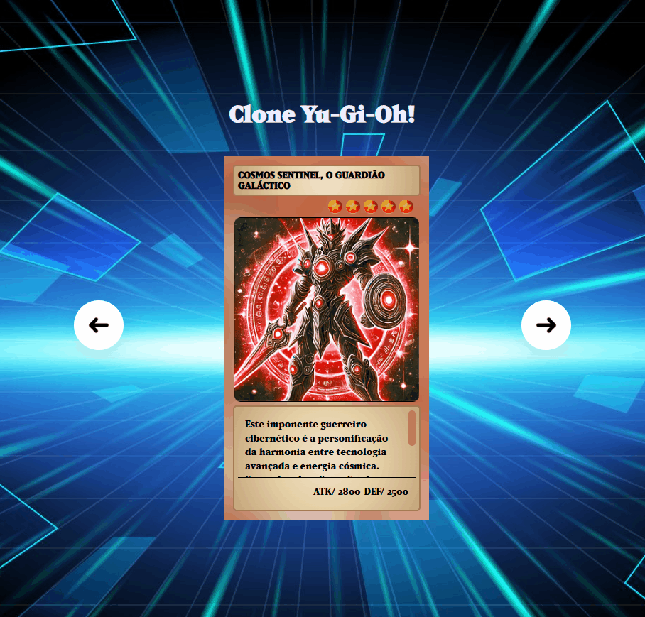

# 🃏 Projeto Site Yu-Gi-Oh

Este é um projeto pessoal de um site inspirado nas cartas do anime Yu-Gi-Oh!, criado com o objetivo de praticar HTML, CSS e JavaScript.

 ## 📷 Preview
Veja uma prévia do projeto em funcionamento:
<a href="https://ferreirag-dev.github.io/clone-yu-gi-oh/" target="_blank"> 

 
</a>

## 🛠️ Tecnologias utilizadas 

- HTML
- CSS
- JS

## 🎯Objetivos do projeto

- Praticar estruturação de páginas com HTML

- Utilizar CSS para estilização e responsividade

- Implementar interatividade com JavaScript

- Aprender a publicar projetos no GitHub Pages

## 🧠 O que aprendi

- Criar componentes visuais com HTML e CSS

- Utilizar animações simples e efeitos visuais

- Trabalhar com manipulação de DOM usando JS

- Publicar um site no GitHub Pages

## 📁 Como rodar o projeto localmente

1. Clone o repositório:

```
git clone https://github.com/FerreiraG-Dev/clone-yu-gi-oh.git
```


2. Abra o arquivo ```index.html``` no seu navegador

## 📨 Contato
Se quiser acompanhar minha evolução como desenvolvedor ou dar sugestões:

GitHub: @ferreirag-dev


Email: ferreiragui31@outlook.com

